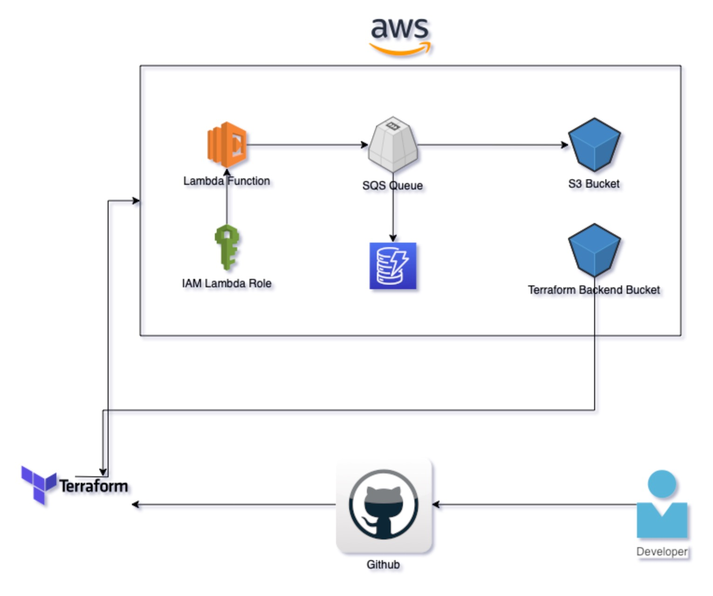

# GT-Assignment #



## Terraform Configuration ##
This Terraform configuration creates an S3 bucket, a Lambda function, an SQS queue, a DynamoDB instance to write the data and the necessary IAM roles and policies for the Lambda function to access the S3 bucket and SQS queue.

Before running Terraform, create a Lambda package with your Lambda function code:
- Make sure there is a ZIP file containing your `lambda_function.py` file.
- Make sure the `lambda-function.zip` in the Terraform configuration to match the name of your ZIP file.

Then, run `terraform init` and `terraform apply` to create the resources.

- With this setup, the data processing pipeline is ready, and you can test it by uploading CSV files to the S3 bucket. 
- Given example data turned into .csv files for test purposes
- Please make sure AWS CLI is configured before running the script.
- Export following values before running `terraform apply`:
```
export AWS_ACCESS_KEY_ID=your_access_key
export AWS_SECRET_ACCESS_KEY=your_secret_key
```
- After running `terraform apply`, run `copy_csvs_to_bucket.sh` to copy needed files to the bucket automatically.
- To be able to run `terraform destroy` empty your bucket manually first from AWS Console.

# Used Resources: 
```
- aws
- terraform
- "aws_s3_bucket" "data_bucket"
- "aws_dynamodb_table" "processed_data"
- "aws_sqs_queue" "data_queue"
- "aws_lambda_function" "data_processor"
- "aws_lambda_event_source_mapping" "s3_event"
- "aws_iam_role" "lambda_role"
- "aws_iam_role_policy_attachment" "s3_lambda_access"
- "aws_iam_role_policy_attachment" "dynamodb_lambda_access"
- "aws_iam_role_policy_attachment" "sqs_lambda_access"
```

Run Lambda function with:
`aws lambda invoke --function-name data_processing --payload file://s3_event.json output.txt`

